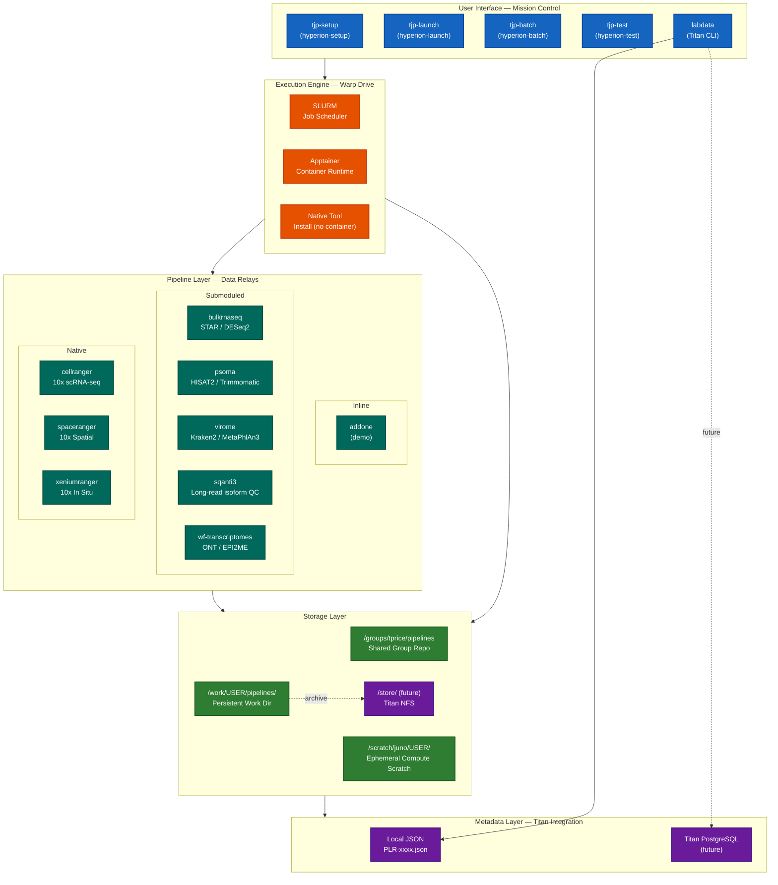
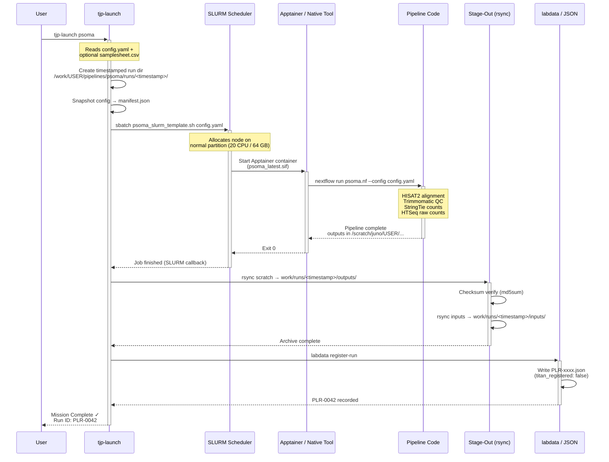
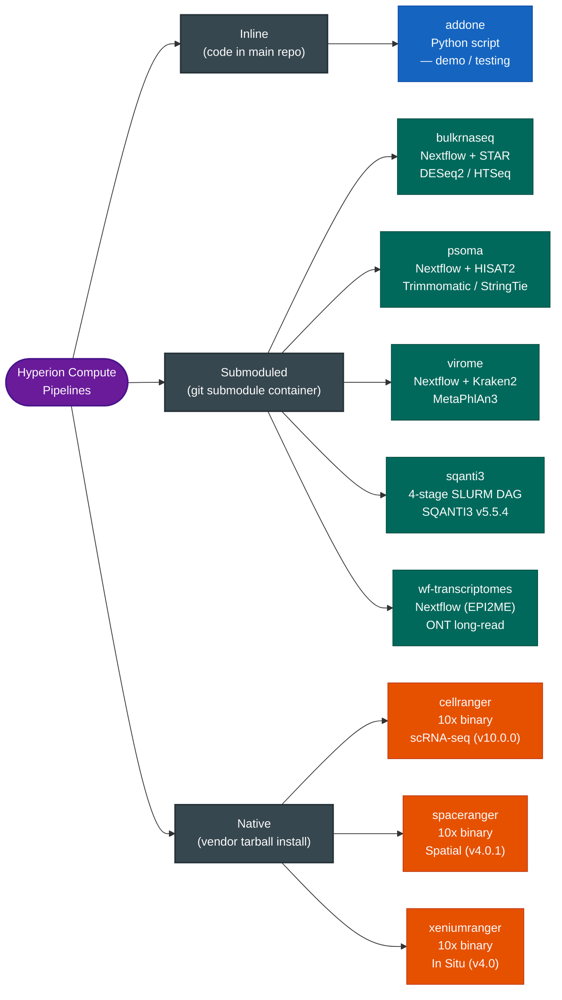
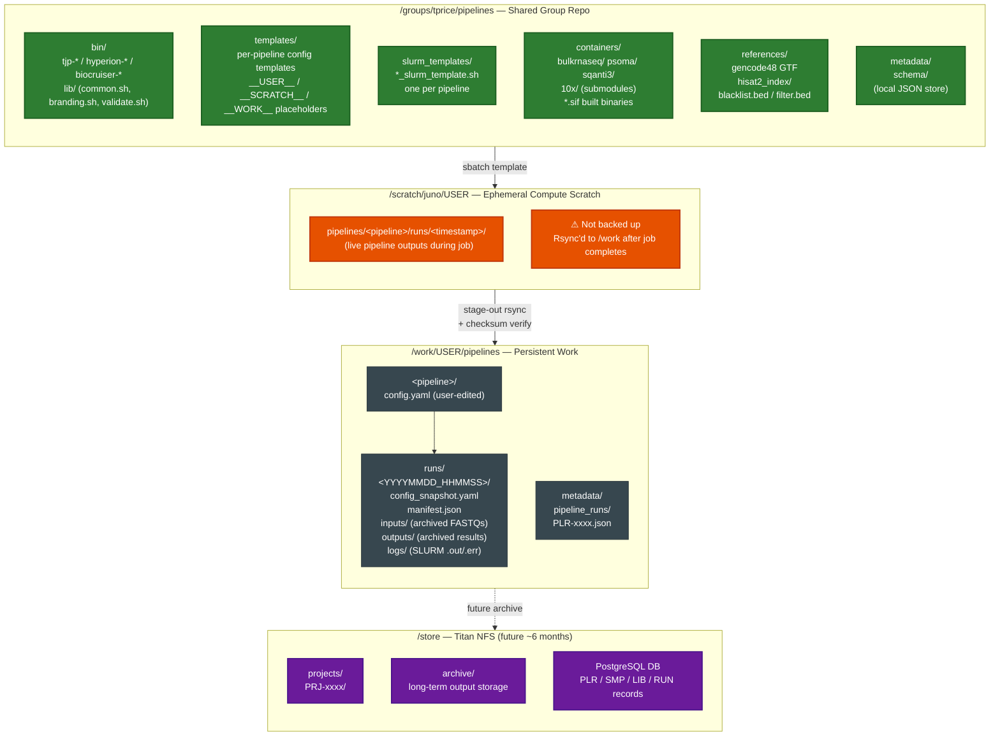
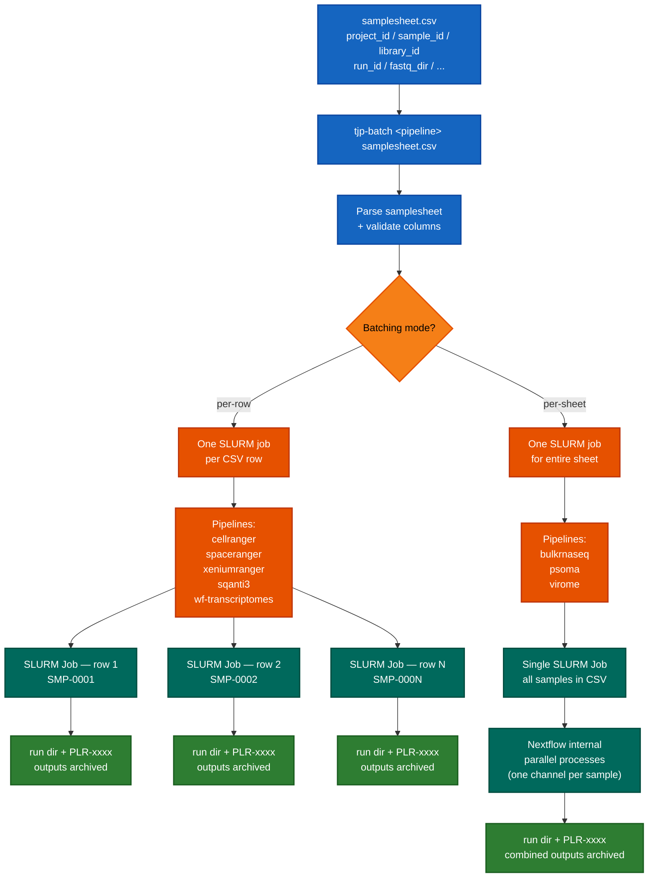

# Hyperion Compute
## Distributed Bioinformatics Execution Framework

**Center for Advanced Pain Studies — UT Dallas**

---

## Introduction

Hyperion Compute is the TJP group's HPC pipeline framework, deployed on the Juno cluster at UT Dallas. It provides a standardized, reproducible execution environment for bioinformatics workflows ranging from bulk RNA-seq and single-cell 10x Genomics assays to long-read isoform characterization and metagenomics. The framework is designed to scale horizontally — new pipelines and users can be onboarded without modifying the core infrastructure.

The system is built on four interlocking layers: **SLURM** schedules compute resources, **Apptainer** (or native tool installs) provides a reproducible execution environment, **pipeline code** (Nextflow or shell-driven) implements domain logic, and **YAML configs** parameterize each run. A command-line interface (`tjp-*`, aliased as `hyperion-*` and `biocruiser-*`) wraps this stack for researchers, while a metadata layer (currently local JSON, converging on Titan PostgreSQL) records every run for reproducibility and auditability.

These diagrams are intended for both **technical HPC users** setting up or debugging pipelines and **management/administrative stakeholders** who need a high-level understanding of data flow, storage, and infrastructure dependencies.

---

## 1. System Architecture Overview

Hyperion Compute is composed of five logical layers, each with a distinct responsibility. Researchers interact exclusively with the **User Interface** layer — the CLI tools and config files — and never need to touch the underlying SLURM or container machinery directly. The **Execution Engine** handles resource allocation and environment isolation. The **Pipeline Layer** hosts all eight bioinformatics workflows, grouped by how their dependencies are packaged. The **Storage Layer** spans three tiers: the shared group repository (read-only for users), ephemeral per-user compute scratch, and persistent per-user work directories. The **Metadata Layer** currently records every pipeline run as a local JSON file (PLR-xxxx format); this will migrate to a centralized PostgreSQL database on the forthcoming Titan storage system.



---

## 2. Execution Flow (Single Pipeline Run)

This sequence diagram traces the full lifecycle of a single pipeline run from the moment a researcher invokes `tjp-launch` to the point where a permanent record is written to the metadata store. The flow illustrates how responsibility is handed off between the user-facing CLI, SLURM's job scheduler, the container or native tool runtime, the pipeline logic itself, and finally the stage-out and metadata subsystems. Each step is decoupled: if SLURM is busy, the job queues without blocking the researcher; if stage-out fails, the raw compute outputs on scratch remain intact for manual recovery.



---

## 3. Pipeline Taxonomy

Hyperion Compute hosts eight bioinformatics pipelines organized into three architectural families. **Inline** pipelines bundle their code directly in the shared repository and are suitable for simple tasks or framework testing. **Submoduled** pipelines reference external container repositories (git submodules), each encapsulating a container definition and pipeline scripts; this keeps the main repo lean while enabling independent versioning of each pipeline's dependencies. **Native** pipelines require no container at all — the 10x Genomics tools are installed from vendor tarballs and manage their own parallelism. All three families share the same CLI interface (`tjp-launch`, `tjp-batch`) and produce the same run-directory and manifest structure.



---

## 4. Filesystem Layout

Hyperion Compute uses a three-tier filesystem model on the Juno HPC cluster. The **shared group repository** (`/groups/tprice/pipelines`) is maintained by the TJP group and is read-only for most users; it contains the CLI tools, SLURM templates, container definitions, and config templates. Each user has a **persistent work directory** (`/work/$USER/pipelines/`) where run records, config snapshots, and archived outputs live permanently. **Ephemeral compute scratch** (`/scratch/juno/$USER/`) holds live pipeline outputs during a job and is not backed up — data is automatically archived to the work directory at job completion via rsync. A fourth tier, `/store/` on the future Titan NFS filesystem, will eventually replace per-user work directories as the permanent data home.



---

## 5. Titan Integration Roadmap

Titan is the TJP group's forthcoming centralized research data management system, expected to come online approximately six months from the time of writing. Hyperion Compute is designed so that the researcher-facing interface (`labdata`, config YAML fields, run IDs) remains **identical** across both phases — only the backend storage changes. In Phase 1 (current), each pipeline run generates a local JSON file named with a PLR-xxxx identifier, and the `titan_registered` flag is set to `false`. In Phase 2, the same `labdata register-run` command will instead perform a network INSERT into a PostgreSQL database, set `titan_registered: true`, and link the run record to project, sample, library, and run IDs stored in the DB. No changes to SLURM templates, pipeline code, or user configs are required for this transition.

```mermaid
graph LR
    %% ── Shared Interface (stable across both phases) ──────────────────
    subgraph IFACE["Stable Interface (both phases)"]
        direction TB
        cfg["YAML Config Fields\ntitan_project_id\ntitan_sample_id\ntitan_library_id\ntitan_run_id"]
        csv["Samplesheet Columns\nproject_id / sample_id\nlibrary_id / run_id"]
        ids["ID Scheme\nPRJ-xxxx SMP-xxxx\nLIB-xxxx RUN-xxxx PLR-xxxx"]
        labdata_cli["labdata CLI\nregister-run\nlist-runs / get-run"]
    end

    %% ── Phase 1 ───────────────────────────────────────────────────────
    subgraph P1["Phase 1 — Current (v6.0.0)"]
        direction TB
        p1_store["/work/USER/pipelines/metadata/\npipeline_runs/PLR-xxxx.json"]
        p1_flag["titan_registered: false"]
        p1_note["Local filesystem only\nNo network dependency"]
    end

    %% ── Phase 2 ───────────────────────────────────────────────────────
    subgraph P2["Phase 2 — Titan Online (future)"]
        direction TB
        p2_store["PostgreSQL Database\nTitan server"]
        p2_nfs["/store/ NFS\nLong-term data archive"]
        p2_flag["titan_registered: true"]
        p2_note["DB INSERT on register\nFull audit trail"]
    end

    %% ── Flow ──────────────────────────────────────────────────────────
    IFACE -->|"writes to"| P1
    IFACE -.->|"will write to\n(same CLI call)"| P2
    P1 -.->|"migration path\n(one-time import)"| P2

    %% ── Styling ───────────────────────────────────────────────────────
    classDef userTool fill:#1565C0,color:#fff,stroke:#0D47A1,stroke-width:2px
    classDef current fill:#2E7D32,color:#fff,stroke:#1B5E20,stroke-width:2px
    classDef future fill:#6A1B9A,color:#fff,stroke:#4A148C,stroke-width:2px

    class cfg,csv,ids,labdata_cli userTool
    class p1_store,p1_flag,p1_note current
    class p2_store,p2_nfs,p2_flag,p2_note future
```



---

## 6. Batch Execution Flow

The `tjp-batch` command enables researchers to process entire cohorts from a single CSV samplesheet, rather than launching individual pipeline runs manually. The framework supports two distinct batching modes determined by the pipeline type. **Per-row** pipelines (cellranger, spaceranger, xeniumranger, sqanti3, wf-transcriptomes) spawn one independent SLURM job per CSV row, allowing each sample to run in parallel on separate compute nodes. **Per-sheet** pipelines (bulkrnaseq, psoma, virome) submit a single SLURM job that reads all rows internally; these pipelines are designed to handle multi-sample cohorts natively through Nextflow's process-level parallelism. Both modes produce the same per-run directory structure and PLR-xxxx metadata records, and both respect the same config YAML fields and Titan ID columns.



---

## Rendering

These diagrams use [Mermaid](https://mermaid.js.org/) v10+ syntax and can be rendered in several ways:

**GitHub / GitLab**
Push this file to a GitHub or GitLab repository. Both platforms natively render Mermaid blocks in Markdown previews with no extensions required.

**VS Code**
Install the [Mermaid Preview](https://marketplace.visualstudio.com/items?itemName=bierner.markdown-mermaid) or [Markdown Preview Mermaid Support](https://marketplace.visualstudio.com/items?itemName=bierner.markdown-mermaid) extension. Open the file and use `Ctrl+Shift+V` (or `Cmd+Shift+V` on macOS) to preview.

**Mermaid CLI (`mmdc`)**
```bash
npm install -g @mermaid-js/mermaid-cli

# Render all diagrams to PNG
mmdc -i docs/architecture.md -o docs/architecture.png

# Render to SVG (vector, scalable for presentations)
mmdc -i docs/architecture.md -o docs/architecture.svg --outputFormat svg
```

**Mermaid Live Editor**
Paste any individual diagram block (the content between the triple backticks) into [https://mermaid.live](https://mermaid.live) for interactive editing and PNG/SVG export.

---

*Hyperion Compute — Center for Advanced Pain Studies, UT Dallas*
*Generated: 2026-04-05 | Framework version: 6.0.0*
